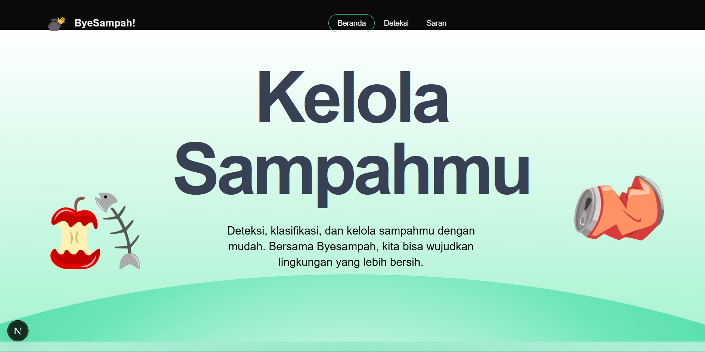
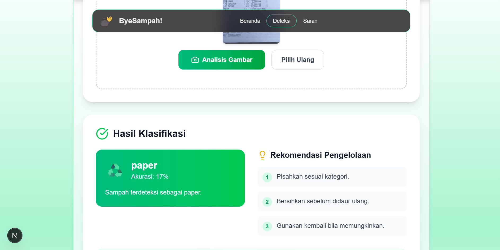
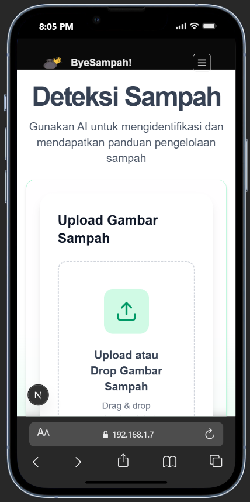

# ByeSampah - AI-Powered Waste Classification Platform

[](https://nextjs.org/)
[](https://www.typescriptlang.org/)
[](https://tailwindcss.com/)
[](https://www.framer.com/motion/)

ByeSampah adalah platform inovatif yang menggunakan kecerdasan buatan untuk membantu masyarakat Indonesia mengelola sampah dengan lebih cerdas dan bertanggung jawab. Melalui teknologi klasifikasi otomatis dan panduan pengelolaan yang komprehensif, kami memudahkan setiap orang untuk berkontribusi dalam menjaga kelestarian lingkungan.

## ✨ Fitur MVP

### 🤖 Klasifikasi Sampah dengan AI
- **Upload gambar** sampah via drag & drop atau kamera
- **Deteksi instan** dengan akurasi hingga 96%
- **15+ kategori sampah** (plastik, organik, kertas, kaca, logam, kardus)
- **Rekomendasi pengelolaan** spesifik untuk setiap jenis sampah

### 💡 Saran & Tips Kreatif
- **Panduan praktis** untuk mengurangi dan mendaur ulang sampah
- **Tips cepat** berdasarkan 6 jenis sampah utama
- **Filter cerdas** berdasarkan kategori (rumah tangga, kantor, komunitas, bisnis)
- **Konten edukasi** tentang nilai ekonomi sampah daur ulang

### 🎨 Pengalaman Pengguna
- **Responsive design** untuk desktop dan mobile
- **Dark/Light mode** support
- **Animasi smooth** dengan Framer Motion
- **Navigasi intuitif** antar fitur

## 🛠️ Tech Stack

### Frontend
- **Framework**: Next.js 15.5.0 (App Router)
- **Language**: TypeScript 5.0
- **Styling**: Tailwind CSS 4.0
- **Animations**: Framer Motion 12.23.12
- **Icons**: Lucide React 0.541.0
- **UI Components**: Radix UI, Custom components

### Backend & AI
- **AI Model**: Hugging Face Transformers (Trash Classification)
- **API**: RESTful API dengan TypeScript
- **Data Processing**: Custom utilities untuk klasifikasi sampah

### Development Tools
- **Package Manager**: npm
- **Linting**: ESLint 9.0
- **Build Tool**: Next.js Turbopack
- **Deployment**: Netlify

## 📁 Struktur Folder

```
byesampah-trashclassification/
├── public/                 # Static assets (SVG, images)
├── src/
│   ├── app/               # Next.js App Router pages
│   │   ├── deteksi/       # Waste detection page
│   │   ├── saran/         # Suggestions page
│   │   └── globals.css    # Global styles
│   ├── components/        # Reusable UI components
│   │   ├── sections/      # Page sections (hero, about, footer)
│   │   ├── ui/           # Base UI components
│   │   └── ImageUpload.tsx # File upload component
│   ├── data/             # Static data (waste types, suggestions)
│   ├── hooks/            # Custom React hooks
│   ├── lib/              # Utilities and configurations
│   ├── services/         # API services (waste classification)
│   └── types/            # TypeScript type definitions
├── package.json          # Dependencies and scripts
├── next.config.ts        # Next.js configuration
├── tailwind.config.mjs   # Tailwind CSS configuration
└── tsconfig.json         # TypeScript configuration
```

## 📸 Screenshot





## 🚀 Setup Lokal

### Prerequisites
- Node.js 18.0 atau lebih baru
- npm, yarn, pnpm, atau bun
- Git

### Instalasi

1. **Clone repository**
   ```bash
   git clone https://github.com/byesampah/byesampah-trashclassification.git
   cd byesampah-trashclassification
   ```

2. **Install dependencies**
   ```bash
   npm install
   # atau
   yarn install
   # atau
   pnpm install
   ```

3. **Jalankan development server**
   ```bash
   npm run dev
   # atau
   yarn dev
   # atau
   pnpm dev
   ```

4. **Buka browser**
   
   Kunjungi [http://localhost:3000](http://localhost:3000) untuk melihat aplikasi.

### Scripts yang Tersedia

```bash
npm run dev      # Jalankan development server dengan Turbopack
npm run build    # Build untuk production
npm run start    # Jalankan production server
npm run lint     # Jalankan ESLint
```

## 🌐 Deployment ke Netlify

### Opsi 1: Deploy Otomatis via GitHub
1. **Connect repository** ke Netlify
2. **Konfigurasi build settings**:
   - Build command: `npm run build`
   - Publish directory: `.next`
3. **Deploy** - Netlify akan otomatis build dan deploy saat push ke branch utama

### Opsi 2: Manual Deploy
1. **Build project locally**
   - Install dependencies: `npm install`
   - Build: `npm run build`

2. **Deploy menggunakan Netlify CLI**
   ```bash
   npx netlify-cli deploy --prod --dir=.next
   ```

### Opsi 3: Drag & Drop
1. **Build project**
   - Install dependencies: `npm install`
   - Build: `npm run build`

2. **Upload folder `.next`** ke Netlify dashboard via drag & drop

### Konfigurasi Netlify
- **Environment Variables**: Tambahkan `NEXT_PUBLIC_API_URL` jika diperlukan
- **Custom Domain**: Konfigurasi domain kustom di dashboard
- **Forms**: Aktifkan Netlify Forms untuk contact form
- **Functions**: Gunakan serverless functions untuk API endpoints

## 🤝 Kontribusi

Kami sangat terbuka untuk kontribusi! Berikut cara berkontribusi:

1. **Fork** repository ini
2. **Buat branch** untuk fitur baru: `git checkout -b feature/nama-fitur`
3. **Install dependencies**: `npm install`
4. **Lakukan perubahan** dan test secara lokal
5. **Commit changes**: `git commit -m 'Tambah fitur baru'`
6. **Push ke branch**: `git push origin feature/nama-fitur`
7. **Buat Pull Request**

### Panduan Kontribusi
- Ikuti standar kode yang ada (ESLint, TypeScript)
- Tambahkan komentar pada kode yang kompleks
- Update dokumentasi jika menambah fitur baru
- Test perubahan secara menyeluruh

## 📞 Kontak Developer

Dapat menghubungi dan atau melakukan pull Request/issue di repositori ,dan:
**ByeSampah Team**
- **Email**: hello@byesampah.com
- **GitHub**: [@byesampah](https://github.com/haykalaul/byesampah)
- **Instagram**: [@byesampah](https://instagram.com/byesampah)
- **Twitter**: [@byesampah](https://twitter.com/byesampah)

## 📄 Lisensi

Proyek ini menggunakan lisensi MIT. Lihat file `LICENSE` untuk detail lebih lanjut.

---

**Mari bersama wujudkan Indonesia Zero Waste!** 🌱♻️
